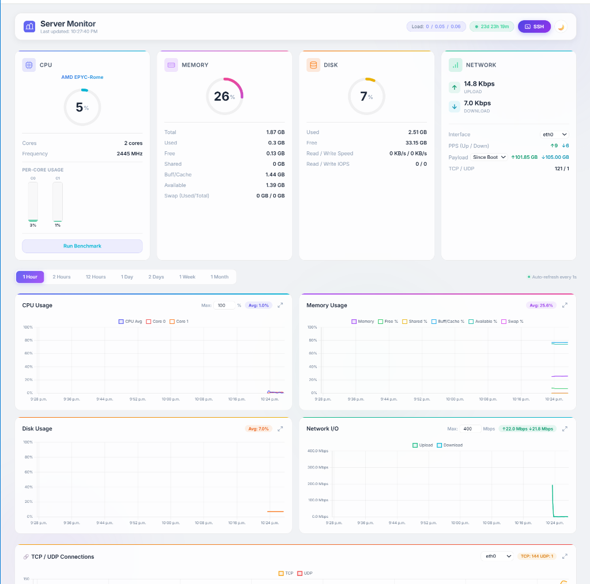

# 📊 Server Monitor Dashboard

A professional, real-time server monitoring dashboard with a high-performance backend and a sleek, glassmorphic frontend. Track your system performance and manage your server directly from your browser.



## ✨ Features

- **Live System Metrics**: Real-time tracking of CPU, RAM, Disk, and Network I/O with smooth animations.
- **Per-Core Visualization**: Detailed per-core CPU usage monitoring.
- **Web SSH Terminal**: Fully functional terminal in your browser powered by xterm.js and asyncssh.
- **CPU Benchmark**: High-intensity multi-core performance testing (with stop functionality).
- **Persistent History**: Stores historical metrics in an optimized SQLite database.
- **Advanced Networking**: Multi-interface support and detailed packet-per-second (PPS) tracking.
- **Beautiful UI**: Modern glassmorphism aesthetic with automatic Dark/Light mode support.

## 🚀 Quick Installation

To install and start the dashboard on a fresh Linux server (Debian, Ubuntu, RHEL, Fedora, CentOS, etc.), simply run:

```bash
curl -sL https://raw.githubusercontent.com/morezaGeek/Server-Monitor/main/install.sh | sudo bash
```

## 🛠 Manual Setup

1. **Clone the repository**:
   ```bash
   git clone https://github.com/morezaGeek/Server-Monitor.git
   cd Server-Monitor
   ```

2. **Setup virtual environment**:
   ```bash
   python3 -m venv venv
   source venv/bin/activate
   pip install -r requirements.txt
   ```

3. **Run the application**:
   ```bash
   uvicorn app:app --host 0.0.0.0 --port 8080
   ```

## 🔐 Security
The dashboard enforces secure **HTTP Basic Authentication**.
During installation, the script will prompt you to create a secure **Username** and **Password**. 
These credentials are automatically injected into the dashboard's environment via the systemd service.

## ⚙️ Reconfiguration (Change Port/Credentials)
If you ever need to change your Port, Username, or Password after installation, simply run:
```bash
sudo bash /opt/server-monitor/configure.sh
```

## 🗑️ Uninstallation

If you wish to completely remove the dashboard and its background service, run:
```bash
sudo bash /opt/server-monitor/uninstall.sh
```

## 👨‍💻 Author
Created by **morezaGeek**

## 📄 License
This project is for educational and personal use.
