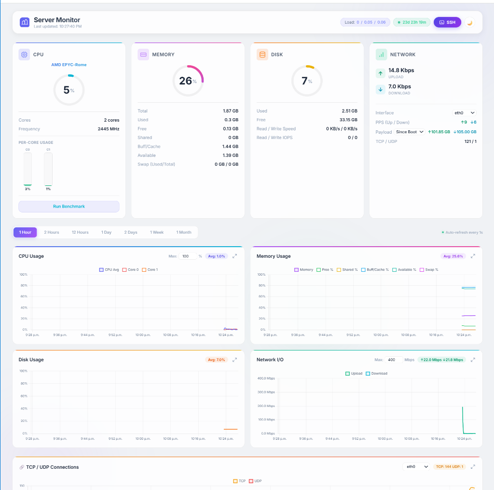

# 📊 Server Monitor Dashboard

A professional, real-time server monitoring dashboard with a high-performance backend and a sleek, glassmorphic frontend. Track your system performance and manage your server directly from your browser.



## ✨ Features

- **Live System Metrics**: Real-time tracking of CPU, RAM, Disk, and Network I/O with smooth animations.
- **Per-Core Visualization**: Detailed per-core CPU usage monitoring.
- **Web SSH Terminal**: Fully functional terminal in your browser powered by xterm.js and asyncssh.
- **CPU Benchmark**: High-intensity multi-core performance testing (with stop functionality).
- **Persistent History**: Stores historical metrics in an optimized SQLite database.
- **Advanced Networking**: Multi-interface support and detailed packet-per-second (PPS) tracking.
- **🌐 Virtual Browser**: Secure, Docker-based Chromium browser accessible directly from the dashboard.
- **Beautiful UI**: Modern glassmorphism aesthetic with automatic Dark/Light mode support.

## 🚀 Quick Installation

To install and start the dashboard on a fresh Linux server (Debian, Ubuntu, RHEL, Fedora, CentOS, etc.), simply run:

```bash
curl -sL https://raw.githubusercontent.com/morezaGeek/Server-Monitor/main/install.sh | sudo bash
```

## 🐳 Docker Installation (Recommended for Containerized Environments)

If you prefer to run Server Monitor in a fully isolated container while maintaining accurate host-level metric tracking (network interfaces, disk throughput, real-time memory usage, and processes), you can deploy it using Docker and Docker Compose.

### Quick Run with Docker
```bash
docker run -d \
  --name server-monitor \
  --restart always \
  --network host \
  -e PORT=8080 \
  -e PANEL_USERNAME=admin \
  -e PANEL_PASSWORD=admin \
  -e PROCFS_PATH=/host/proc \
  -v /proc:/host/proc:ro \
  -v /sys:/host/sys:ro \
  -v $(pwd)/metrics.db:/app/metrics.db \
  morezageek/server-monitor:latest
```

### Running with Docker Compose
1. Create a `docker-compose.yml` file:
   ```yaml
   version: '3.8'
   services:
     server-monitor:
       image: morezageek/server-monitor:latest
       container_name: server-monitor
       restart: always
       network_mode: host
       environment:
         - PORT=8080
         - PANEL_USERNAME=admin
         - PANEL_PASSWORD=admin  # Set a secure password
         - PROCFS_PATH=/host/proc
       volumes:
         - /proc:/host/proc:ro
         - /sys:/host/sys:ro
         - ./metrics.db:/app/metrics.db
   ```
2. Start the container:
   ```bash
   docker compose up -d
   ```
3. Open your browser and navigate to `http://your-server-ip:8080`. Log in with user `admin` and password `admin`.

## 🛠 Manual Setup

1. **Clone the repository**:
   ```bash
   git clone https://github.com/morezaGeek/Server-Monitor.git
   cd Server-Monitor
   ```

2. **Setup virtual environment**:
   ```bash
   python3 -m venv venv
   source venv/bin/activate
   pip install -r requirements.txt
   ```

3. **Run the application**:
   ```bash
   uvicorn app:app --host 0.0.0.0 --port 8080
   ```

## 🔐 Security
The dashboard enforces secure **HTTP Basic Authentication**.
During installation, the script will prompt you to create a secure **Username** and **Password**. 
These credentials are automatically injected into the dashboard's environment via the systemd service.

## ⚙️ Management (Uninstall / Reconfigure / Status)
All management options are built into the same install script. Just run it again:
```bash
curl -sL https://raw.githubusercontent.com/morezaGeek/Server-Monitor/main/install.sh | sudo bash
```
The interactive menu will offer:
1. 🚀 **Install / Update**
2. 🗑️ **Uninstall**
3. ⚙️ **Change Port / Credentials**
4. 📋 **View Service Status**

## 🌐 Virtual Browser

The dashboard includes a **secure, Docker-based virtual Chromium browser** that runs directly on your server.

### How It Works
- A [linuxserver/chromium](https://docs.linuxserver.io/images/docker-chromium) container is deployed **locally** on port `127.0.0.1:3000` (never exposed externally).
- All traffic is proxied through your existing HTTPS connection (port 443).
- Two-layer authentication: **Dashboard login** + **Virtual Browser login**.

### Usage
1. Open the **Virtual Browser** modal from the dashboard.
2. Set a **Username** and **Password** for the browser.
3. Click **Install / Update** — Docker will be installed automatically if needed.
4. Once ready, click **Open Browser Tab** to launch Chromium.

### Requirements
- **Docker** (auto-installed during setup)
- ~1.5 GB disk space for the Chromium image
- Works on **Ubuntu, Debian, AlmaLinux, Fedora, CentOS, RHEL**

## 👨‍💻 Author
Created by **morezaGeek**

## 📄 License
This project is for educational and personal use.
